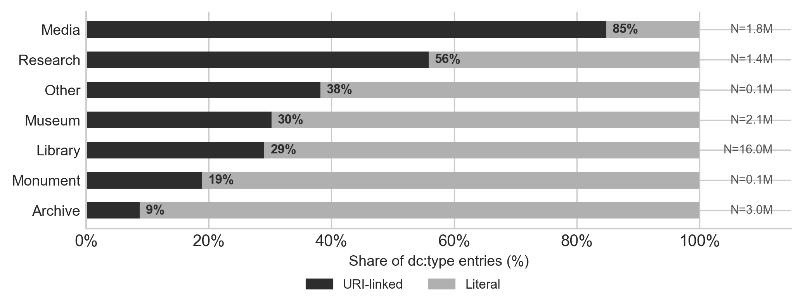
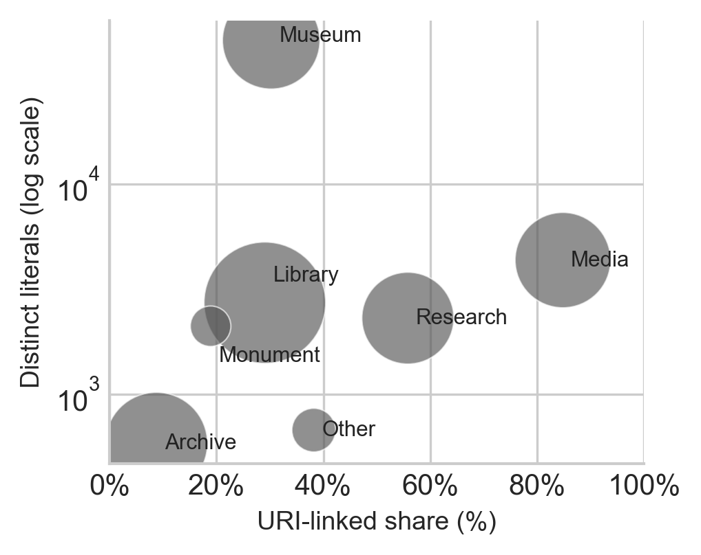

# dc_type analysis

Generated: 2026-05-22
Source data: `output/parquet/s*_meta.parquet`
Raw data: [`data/processed/dc_type_by_provider.csv`](https://github.com/anntanp/gemea/blob/main/data/processed/dc_type_by_provider.csv), [`data/processed/dc_type_by_sector.csv`](https://github.com/anntanp/gemea/blob/main/data/processed/dc_type_by_sector.csv)
Producing script: [`scripts/analysis/dc_type_analysis.py`](https://github.com/anntanp/gemea/blob/main/scripts/analysis/dc_type_analysis.py)

## 1. Overview

| Metric | Value |
|--------|-------|
| Total dc_type entries | 24,616,731 |
| URI entries (is_ext_uri=True) | 7,968,700 (32.4%) |
| Literal entries (is_ext_uri=False) | 16,648,031 (67.6%) |
| Providers | 658 |

**Note**: URI entries store the resolved prefLabel as `name` with `is_ext_uri=True`; the authority URI is in the source data but not retained in the Parquet column. Entries with an external URI but no resolvable label in the same record are omitted from the Parquet and written to `concept_labels.duckdb` for later enrichment.

## 2. By sector

| Sector | URI entries | Literal entries | Distinct literals | URI % |
|--------|-------------|-----------------|-------------------|-------|
| Archive | 266,868 | 2,778,940 | 582 | 9% |
| Library | 4,637,723 | 11,322,551 | 2,724 | 29% |
| Monument | 20,107 | 86,261 | 2,105 | 19% |
| Research | 798,022 | 631,512 | 2,300 | 56% |
| Media | 1,560,596 | 279,042 | 4,349 | 85% |
| Museum | 640,313 | 1,476,855 | 48,484 | 30% |
| Other | 45,071 | 72,870 | 673 | 38% |

Key observations:

- **Media Library (s5) is the most linked sector** — 85% of dc_type entries carry authority URIs. Controlled vocabulary use is nearly universal.
- **Archive (s1) is the least linked** — 9% URIs, 582 distinct literals. Type annotation is sparse and homogeneous; structural metadata is in `hierarchy_type` instead.
- **Museum (s6) has by far the most heterogeneous literals** — 48,484 distinct values despite being only 30% linked. Free-text type annotation dominates; values are institution-specific and unstandardized.
- **Research (s4) is evenly split** — 56% URI, 44% literal; higher distinct literal count (2,300) than Archive or Library relative to volume suggests varied annotation practice across research institutions.
- **Library (s2) dominates by volume** — 65% of all entries, but only 29% linked. The large literal remainder reflects legacy catalog records with no authority linkage.

## 3. Top 10 providers by URI entries

| Provider | URI entries | Literal entries | Distinct literals |
|----------|-------------|-----------------|-------------------|
| PE423JPDSCU6C72BAC2PUBOHAINDRGFO | 1,468,601 | 1,558,139 | 2,320 |
| CJY7MSLPOPB7FTPC7JM5K2GGM5PBGLYI | 1,301,529 | 144,885 | 2,460 |
| 3HK6MSZN45JDHFPFYSN2Z476QKJPJSRA | 906,581 | 139,660 | 19 |
| 6GFV3I4ELFEEFQIN2WECOXMTI5FUWHCK | 544,488 | 681,084 | 39 |
| IW3AOJYDU4MT3MFK77H6L6RJ4VJG3LKF | 407,095 | 9,276 | 1,289 |
| 2Q37XY5KXJNJE5MV6SWP3UKKZ6RSBLK5 | 299,674 | 25,826 | 146 |
| BZVTR553HLJBDMQD5NCJ6YKP3HMBQRF4 | 292,545 | 722,797 | 22 |
| JYK3LT7TXBO32BIOFZZM5VWGEFPOFYK6 | 255,194 | 464,433 | 18 |
| Y4U5WTWIXQYY4P2DWZLZYH3Z4ETTJ336 | 196,904 | 0 | 0 |
| Q5Q6S6XOPTGP3BUM4I2JNP7V53BAWOTT | 186,539 | 336,955 | 17 |

Provider `Y4U5WTWIXQYY4P2DWZLZYH3Z4ETTJ336` is entirely URI-linked (0 literals) — fully controlled vocabulary with no free-text annotation.

## 4. Top 10 providers by literal entries

| Provider | URI entries | Literal entries | Distinct literals |
|----------|-------------|-----------------|-------------------|
| PE423JPDSCU6C72BAC2PUBOHAINDRGFO | 1,468,601 | 1,558,139 | 2,320 |
| 265BI7NE7QBS4NQMZCCGIVLFR73OCOSL | 0 | 1,735,188 | 37 |
| CJY7MSLPOPB7FTPC7JM5K2GGM5PBGLYI | 1,301,529 | 144,885 | 2,460 |
| 6GFV3I4ELFEEFQIN2WECOXMTI5FUWHCK | 544,488 | 681,084 | 39 |
| BZVTR553HLJBDMQD5NCJ6YKP3HMBQRF4 | 292,545 | 722,797 | 22 |
| 3HK6MSZN45JDHFPFYSN2Z476QKJPJSRA | 906,581 | 139,660 | 19 |
| VKNQFFAKOR4XZWJJKUX3NGYSZ3QZAXCW | 0 | 983,588 | 9 |
| 4EV676FQPACNVNHFEJHGKUY55BXC3QMB | 0 | 913,722 | 2 |
| URIY2TZIE4FK57ZV6VEYVF7EDVRS2B3E | 0 | 827,407 | 17 |
| JYK3LT7TXBO32BIOFZZM5VWGEFPOFYK6 | 255,194 | 464,433 | 18 |

Several high-volume literal providers use very few distinct values (e.g. `4EV676...` has 913K entries with only 2 distinct literals; `VKNQF...` has 983K with 9) — highly repetitive controlled literals, not authority-linked but de facto standardized.

## 5. Figures

Produced by [`scripts/analysis/dc_type_figures.py`](https://github.com/anntanp/gemea/blob/main/scripts/analysis/dc_type_figures.py).

**Fig 1** — URI vs Literal share by sector (sorted ascending by URI%):

**Fig 2** — Heterogeneity space: URI% × distinct literals, bubble size = total entries (log-normalized):

Key patterns visible across both figures:
- Authority-linking rates span 9% (Archive) to 85% (Media Library) — a 9× range within the same corpus.
- Library dominates by volume (N=16.0M, 65% of all entries) but links only 29% of its `dc_type` entries.
- Museum occupies a unique position: moderate volume (N=2.1M), low URI rate (30%), yet extreme literal heterogeneity (48,484 distinct values) — no other sector combines these three properties.
