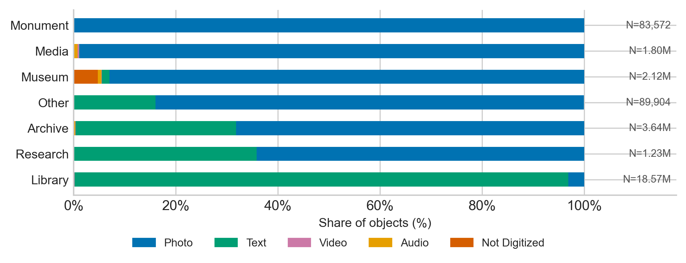
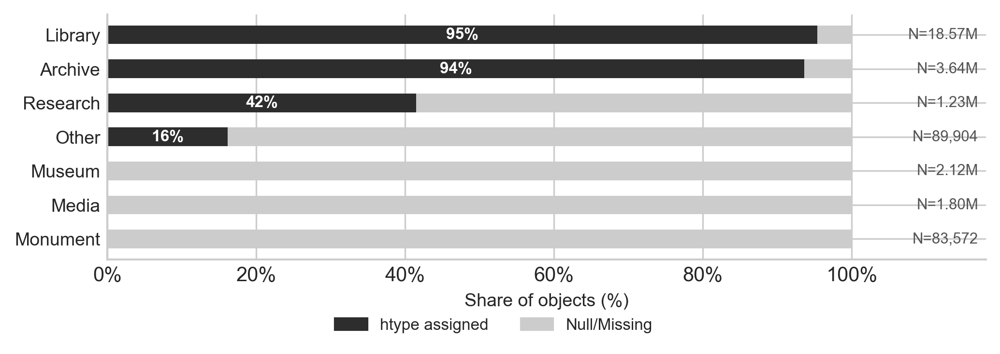
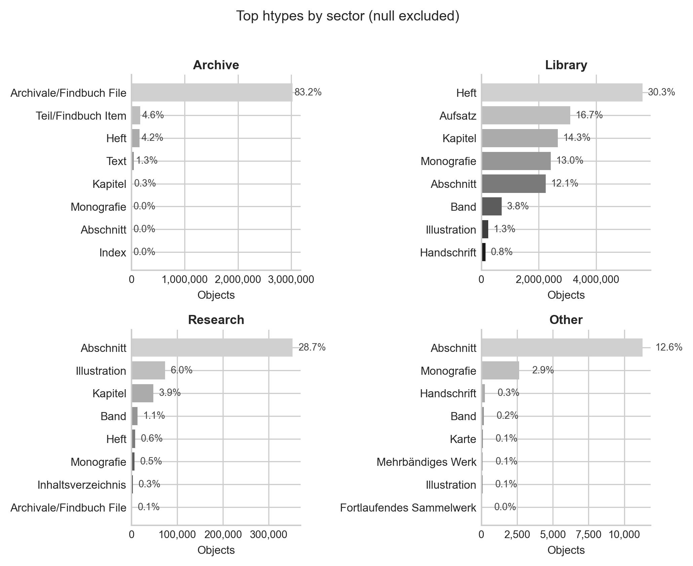

# mediatype and hierarchy_type analysis

Generated: 2026-05-25
Source data: `output/parquet/s*_meta.parquet`
Raw data: [`data/processed/mediatype_by_sector.csv`](https://github.com/anntanp/gemea/blob/main/data/processed/mediatype_by_sector.csv), [`data/processed/htype_by_sector.csv`](https://github.com/anntanp/gemea/blob/main/data/processed/htype_by_sector.csv)
Producing script: [`scripts/analysis/mediatype_htype_analysis.py`](https://github.com/anntanp/gemea/blob/main/scripts/analysis/mediatype_htype_analysis.py)

## 1. Overview

| Metric | Value |
|--------|-------|
| Total objects | 27,526,560 |
| Sectors | 7 |
| Distinct mediatypes observed | 5 (Audio, Photo, Text, Video, Not Digitized) |
| Objects with null mediatype | 66 (< 0.001%) |
| Distinct htypes observed | 25 |
| Objects with null htype | 5,888,678 (21.4%) |

## 2. Objects per sector

| Sector | Objects | % |
|--------|---------|---|
| Archive | 3,638,021 | 13.2% |
| Library | 18,570,245 | 67.5% |
| Monument | 83,572 | 0.3% |
| Research | 1,227,252 | 4.5% |
| Media | 1,799,838 | 6.5% |
| Museum | 2,117,728 | 7.7% |
| Other | 89,904 | 0.3% |

Library dominates at two thirds of the corpus. Museum and Archive together account for another 21%.

## 3. Mediatype by sector

| Sector | Audio | Photo | Text | Video | Not Digitized | Null |
|--------|-------|-------|------|-------|---------------|------|
| Archive | 12,641 (0.3%) | 2,479,304 (68.1%) | 1,145,030 (31.5%) | 578 (0.0%) | 468 (0.0%) | 0 |
| Library | 674 (0.0%) | 583,398 (3.1%) | 17,951,874 (96.7%) | 34,231 (0.2%) | 7 (0.0%) | 60 |
| Monument | 0 | 83,571 (100.0%) | 0 | 0 | 1 (0.0%) | 0 |
| Research | 764 (0.1%) | 787,336 (64.2%) | 439,036 (35.8%) | 116 (0.0%) | 0 | 0 |
| Media | 14,134 (0.8%) | 1,778,580 (98.8%) | 1,657 (0.1%) | 5,462 (0.3%) | 0 | 5 |
| Museum | 15,717 (0.7%) | 1,969,095 (93.0%) | 31,854 (1.5%) | 667 (0.0%) | 100,331 (4.7%) | 1 |
| Other | 4 (0.0%) | 75,410 (83.9%) | 14,397 (16.0%) | 36 (0.0%) | 0 | 57 |

Key observations:

- **Photo is the dominant mediatype corpus-wide** — 6 of 7 sectors are majority Photo. Monument (100%) and Media (99%) are essentially Photo-only.
- **Library is the exception** — 97% Text, reflecting digitized print collections. Its 18M text objects drive the corpus-wide text share.
- **Archive is mixed** — 68% Photo (digitized physical materials), 31% Text (finding aids, transcriptions). The split reflects both physical and born-digital holdings.
- **Research mirrors Archive** — 64% Photo, 36% Text; similar dual-track digitization profile.
- **Museum has notable Not Digitized volume** — 100K objects (4.7%) flagged as not digitized, the only sector with a meaningful share. Physical holdings without digital surrogates.
- **Audio and Video are marginal everywhere** — Media Library has the largest Audio share (0.8%) and the only meaningful Video count (5,462). No sector exceeds 1% for either.

## 4. Hierarchy type (htype) by sector

htype encodes DDB's structural/bibliographic type hierarchy. Three sectors have no htype assignment at all.

### 4.1 Sectors with no htype

| Sector | Objects | htype coverage |
|--------|---------|----------------|
| Monument | 83,572 | 0% (100% null) |
| Media | 1,799,838 | 0% (100% null) |
| Museum | 2,117,728 | 0% (100% null) |

These sectors do not use htype in the DDB metadata model; structural typing is expressed differently (or not at all).

### 4.2 Archive (s1)

| htype | Count | % |
|-------|-------|---|
| Archivale/Findbuch File | 3,028,126 | 83.2% |
| Null/Missing | 230,876 | 6.3% |
| Teil/Findbuch Item | 165,812 | 4.6% |
| Heft | 152,722 | 4.2% |
| Text | 46,147 | 1.3% |
| Kapitel | 11,497 | 0.3% |
| Monografie | 1,428 | 0.0% |
| Abschnitt | 676 | 0.0% |
| Index | 298 | 0.0% |
| Handschrift | 212 | 0.0% |

Archive is dominated by archival-specific types (83% Archivale/Findbuch File). The small bibliographic tail (Heft, Text, Monografie) reflects integrated library-style holdings from some archive providers.

### 4.3 Library (s2)

| htype | Count | % |
|-------|-------|---|
| Heft | 5,620,537 | 30.3% |
| Aufsatz | 3,098,229 | 16.7% |
| Kapitel | 2,664,050 | 14.3% |
| Monografie | 2,416,560 | 13.0% |
| Abschnitt | 2,246,940 | 12.1% |
| Null/Missing | 863,409 | 4.6% |
| Band | 704,941 | 3.8% |
| Illustration | 241,546 | 1.3% |
| Handschrift | 139,618 | 0.8% |
| Beilage | 134,291 | 0.7% |

Library shows broad bibliographic coverage. Top types (Heft, Aufsatz, Kapitel, Monografie, Abschnitt) together cover 86%; the long tail extends to 25 distinct htypes across the sector.

### 4.4 Research (s4)

| htype | Count | % |
|-------|-------|---|
| Null/Missing | 717,787 | 58.5% |
| Abschnitt | 352,274 | 28.7% |
| Illustration | 73,343 | 6.0% |
| Kapitel | 47,671 | 3.9% |
| Band | 13,416 | 1.1% |
| Heft | 7,713 | 0.6% |
| Monografie | 6,610 | 0.5% |
| Inhaltsverzeichnis | 3,194 | 0.3% |
| Archivale/Findbuch File | 1,469 | 0.1% |
| Beigefügtes/enthaltenes Werk | 1,334 | 0.1% |

Research has the highest null rate of any structured sector (59%). Where assigned, Abschnitt (29%) dominates — reflecting journal article and chapter-level objects from research repositories.

### 4.5 Other (s7)

| htype | Count | % |
|-------|-------|---|
| Null/Missing | 75,348 | 83.8% |
| Abschnitt | 11,283 | 12.6% |
| Monografie | 2,631 | 2.9% |
| Handschrift | 238 | 0.3% |
| Band | 166 | 0.2% |
| Karte | 96 | 0.1% |
| Mehrbändiges Werk | 76 | 0.1% |
| Illustration | 63 | 0.1% |
| Fortlaufendes Sammelwerk | 3 | 0.0% |

Other is mostly untyped (84%). The structured tail mirrors Library's bibliographic types.

## 5. Figures

Produced by [`scripts/analysis/mediatype_htype_figures.py`](https://github.com/anntanp/gemea/blob/main/scripts/analysis/mediatype_htype_figures.py).

**Fig 1** — Mediatype composition per sector (sorted ascending by Photo%):

**Fig 2** — htype coverage: assigned vs null per sector:

**Fig 3** — Top htypes per covered sector (null excluded):

## 6. Cross-cutting observations

- **htype coverage is sector-specific**: Archive (94% covered), Library (95%), Research (41%), Other (16%) — the remainder (Monument, Media, Museum) have zero coverage. htype is not a reliable cross-sector signal.
- **Library's htype distribution is the only one with informative spread** — 25 distinct types, no single type exceeding 30%. For type-based classification, Library is the well-labeled sector.
- **Archive uses a separate htype vocabulary** — archival types (Archivale/Findbuch File, Teil/Findbuch Item, Bestand, Gliederung) are specific to EAD/finding-aid structure and do not overlap semantically with Library bibliographic types.
- **Null htype is highest in Research (59%) and Other (84%)** — these sectors have the weakest structural annotation and the lowest reliability for type-conditioned queries.
