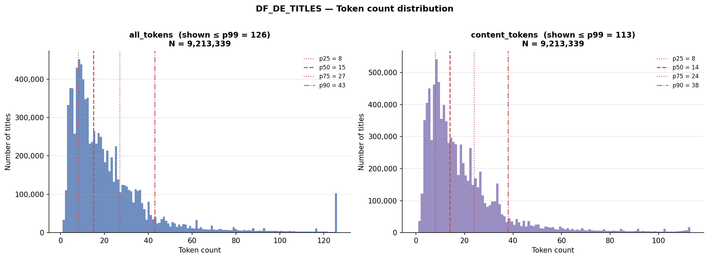

# GeMeA — DF_DE_TITLES: Source and Title-Length Distribution

**SR-10** in [ner-bibliographic.md](ner-bibliographic.md). See also [title-length-thresholds.md](title-length-thresholds.md).

---

## 1. Corpus provenance

`DF_DE_TITLES` originates in `2023.11 NER.ipynb` — the earliest notebook in the series. `2024.01 MT-QA.ipynb` produced the timestamped pickle (`DF_DE_TITLES_20240125b.pkl`) but is not the source of the variable definition.

Definition (from `2023.11 NER.ipynb`, consistent with `2023.12 Relation Extraction.ipynb`):

> "4,477,641 objects are titles of all TEXT objects, tagged to be in German (`dc:language`) and identified by `langid` to be in German."

Selection funnel:

| | No. Records |
|---|---|
| Total Titles (DDB) | 16,805,998 |
| TEXT | 8,402,999 |
| Valid HTYPEs (% of TEXT) | 1,812,559 (21.57%) |
| No Language Tags (% of valid) | 384,405 (21.21%) |
| **Titles tagged + identified as German** | **4,477,641 (53.29%)** |

`DF_DE_TITLES` is a **language filter** on the full DDB TEXT dump: `dc:language` = German AND `langid` = German. Not filtered by `dc:type`, provider, or era. Tokenization in the source notebook uses `spacy.load` (model unspecified in the trace).

**Implication.** The corpus spans all eras and `dc:type` values — both long ISBD strings and short bare titles. ISBD coverage figures (20.2% ` :`, 0.8% ` /`) reflect this broad population.

---

## 2. Token-count distribution

Script: `scripts/explore_token_distribution.py` — raw distribution of `all_tokens` and `content_tokens` across all 4,477,780 titles.

Percentile table:

| Percentile | all_tokens | content_tokens |
|---|---|---|
| p10 | 2 | 1 |
| p25 | 4 | 2 |
| p33 | 5 | 3 |
| p50 | 8 | 5 |
| p66 | 12 | 6 |
| p75 | 14 | 8 |
| p90 | 24 | 13 |
| p95 | 36 | 19 |
| p99 | 74 | 40 |

Shape: roughly flat from 1–9 tokens (5–8% each), peak at 4 tokens (8.0%), then steadily declining. Notable bump at 20 tokens (1.9% vs. 1.3% at 19 and 1.0% at 21) — likely a truncation artifact in the source data.

**Threshold decision: quartiles (≤4 / 5–14 / >14)** — p25 = 4, p75 = 14, equal outer groups (~25% each). Full rationale and alternatives in [title-length-thresholds.md](title-length-thresholds.md).

---

## 3. Title-length distribution by year

Script: `scripts/analyse_title_lengths.py` — token counts from pre-computed `all_tokens` (includes stopwords and punctuation) and `content_tokens` (stopwords removed; punctuation retained); year from `dates` column (1400–2029), falling back to title regex for nulls.

Year coverage: 89.4% from `dates` column, 1.0% from title regex fallback, **9.6% no year** (429,097 titles).

Overall distribution (4,477,780 titles; `all_tokens` including stopwords and punctuation):

| Category | Threshold | Count | % |
|---|---|---|---|
| Short | ≤ 4 tokens (p25) | 1,269,034 | 28.3% |
| Medium | 5–14 tokens (p25–p75) | 2,110,610 | 47.1% |
| Long | > 14 tokens (p75) | 1,098,136 | 24.5% |
| **Median all_tokens** | | **8** | |
| **Median content_tokens** | | **5** | |

Per 25-year bucket (N = 4,048,683 titles with year; 1500+):

| Year bucket | Total | Short% | Medium% | Long% | Median all_t | Median con_t |
|---|---|---|---|---|---|---|
| 1500–1524 | 12,209 | 14.9% | 39.8% | 45.3% | 13 | 7 |
| 1525–1549 | 23,901 | 13.5% | 42.0% | 44.5% | 13 | 7 |
| 1550–1574 | 33,802 | 15.3% | 42.2% | 42.6% | 12 | 6 |
| 1575–1599 | 37,307 | 14.6% | 42.7% | 42.7% | 12 | 6 |
| 1600–1624 | 57,887 | 14.7% | 36.7% | 48.6% | 14 | 7 |
| 1625–1649 | 36,795 | 17.6% | 32.1% | 50.3% | 15 | 8 |
| 1650–1674 | 56,317 | 16.4% | 34.6% | 49.0% | 14 | 7 |
| 1675–1699 | 65,723 | 15.7% | 34.3% | 50.0% | 15 | 7 |
| 1700–1724 | 112,587 | 17.0% | 37.7% | 45.3% | 13 | 6 |
| 1725–1749 | 125,802 | 18.5% | 39.3% | 42.2% | 12 | 6 |
| 1750–1774 | 183,051 | 22.1% | 44.3% | 33.6% | 10 | 5 |
| 1775–1799 | 406,016 | 35.5% | 40.1% | 24.4% | 7 | 4 |
| 1800–1824 | 195,586 | 25.5% | 41.9% | 32.5% | 9 | 5 |
| 1825–1849 | 318,929 | 22.8% | 50.9% | 26.3% | 7 | 5 |
| 1850–1874 | 364,664 | 24.4% | 49.0% | 26.7% | 9 | 5 |
| 1875–1899 | 503,814 | 35.7% | 46.1% | 18.2% | 6 | 4 |
| 1900–1924 | 624,305 | 38.4% | 49.4% | 12.2% | 6 | 4 |
| 1925–1949 | 267,685 | 36.0% | 45.4% | 18.7% | 7 | 4 |
| 1950–1974 | 107,850 | 36.5% | 43.1% | 20.4% | 7 | 4 |
| 1975–1999 | 106,457 | 31.4% | 51.0% | 17.7% | 8 | 5 |
| 2000–2024 | 400,569 | 8.9% | 62.2% | 28.9% | 11 | 6 |

---

## 4. Key findings

- **Pre-1750:** 42–50% long (>14 tokens), median `all_tokens` 12–15. Consistent with early modern title-page conventions: descriptive long-form titles that fold in subtitle, author, place, and printer information into a single string — the title page functioned as a table of contents.
- **Post-1775 shift:** median drops from 10 (1750–1774) to 7 (1775–1799); long falls from 34% to 24%. The shift predates any cataloging standardization and aligns with the Enlightenment and Sturm-und-Drang turn toward concise, standalone titles — a publishing convention change, not a cataloging artifact. Short (≤4) rises further to 35–38% in the 1875–1949 period as modern commercial publishing norms consolidate.
- **2000–2024 reverses:** only 9% short, 62% medium, 29% long — digital-born metadata with richer structured descriptions and subtitle fields recorded separately.
- **Non-content token overhead:** `content_tokens` (stopwords removed, punctuation retained) runs ~3 tokens below `all_tokens` (stopwords + punctuation included) median consistently across all eras.
- **Implication for SR-07 (gold set):** stratify by length as well as era. Pre-1750 long-form records stress the NER model differently from the short modern majority — the TITLE boundary is structurally different. The 9.6% no-year group needs separate treatment — sample by `dc_type` or `silver_tier` instead.

---

## 5. References

The post-1775 title-length shift is attributed to a publishing convention change (early modern → modern title-page norms), not to cataloging standardization. The following are high-confidence anchors for that claim:

- **Reinhard Wittmann, *Geschichte des deutschen Buchhandels* (2nd ed., C.H. Beck, 1999).** The standard history of the German book trade. Covers the Enlightenment transformation of German publishing, including the dissolution of Baroque commercial conventions — long descriptive title pages, colophon-style publisher information embedded in the title area — and their replacement with shorter, standalone titles as bookselling modernized. *Relevant because:* provides the mechanism (trade-driven convention change) and the periodization (late 18th century) for the shift visible in the 1775–1799 bucket.

- **Georg Jäger (ed.), *Geschichte des deutschen Buchhandels im 19. und 20. Jahrhundert*, vol. 1 (MVB, 2001).** Multi-volume institutional history of the German book trade in the modern period. Documents the consolidation of standardized title and imprint conventions through the 19th century, including the separation of title, subtitle, and publication data into distinct bibliographic fields. *Relevant because:* explains the further shortening visible in the 1825–1924 period and the structural reason `all_tokens` stabilizes at median 6–9 — subtitle and publisher information migrate out of the title string.

> **Note:** Both sources support the broad claim (convention change, Enlightenment periodization, German context). Neither contains a quantitative analysis of title-token length. The quantitative evidence is from `DF_DE_TITLES` itself. For a specific citation on early modern long-form title-page structure, the *Archiv für Geschichte des Buchwesens* (Börsenverein des Deutschen Buchhandels) is the primary journal; no specific article is cited here pending a targeted literature search.
