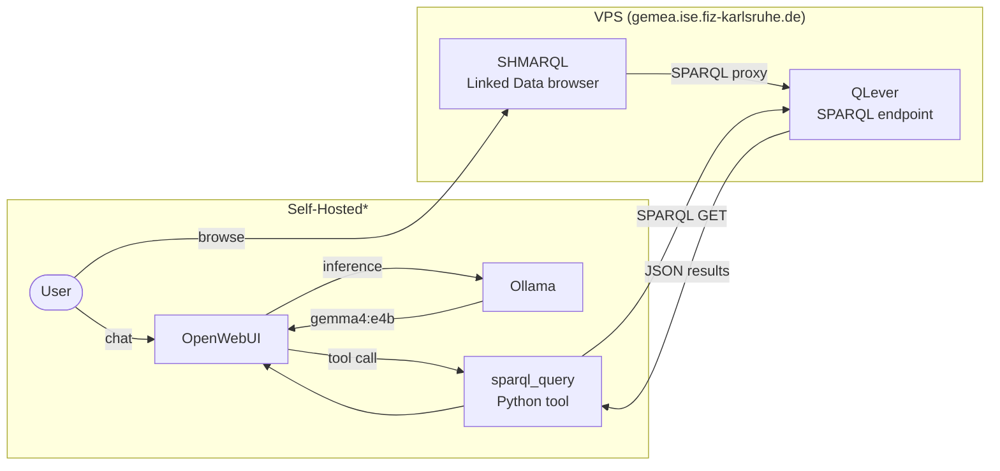

# VPS Setup Plan — GeMeA Production Deployment

**Date**: 2026-04-30
**Context**: ISWC 2026 Resource Track — resource must be publicly accessible when reviewers check it (abstract 2 May, full paper 7 May, reviews ~June 2026). Permanent deployment thereafter.

---

## 0. Architecture



\* Downloadable setup script will be provided. ISE hosts this block on a teach server.

---

## 1. Services

| Service | Hosted on | Role |
|---|---|---|
| QLever | VPS | Single SPARQL endpoint, named graphs (EDM + mocho) |
| SHMARQL | VPS | Linked Data browser + `/sparql` proxy over QLever |
| MCP/MCPO | VPS | QLever exposed as MCP server (via `mcp-server-qlever`) |
| **NT dump download** | VPS | Static HTTP file server serving `edm*.nt` + `mocho*.nt` |
| Ollama | Self-hosted | LLM inference (gemma4:e4b baseline; GPU-optional) |
| OpenWebUI | Self-hosted | Chat UI + native SPARQL tool |

NT files are served directly from the VPS — the same pattern as the GND service dumps.
NTs are **permanent on-disk** (not archived to object storage); the VPS is the canonical
download location referenced in the Resource Availability Statement.

Pattern proven on `goethe-faust/`; adapt `docker-compose.shmarql.yml` and `setup.sh`.

---

## 2. Deployment Plan

### Phase 1 — Pre-Submission (2 May)

| Date | Done | Milestone |
|---|---|---|
| 2 May | [x] | goethe-faust NT [dump downloads](https://gemea.ise.fiz-karlsruhe.de) |

### Phase 2 — Submission (7–15 May)

| Date | Done | Milestone |
|---|---|---|
| 8 May | [ ] | SHMARQL + QLever (goethe-faust corpus) live on VPS |
| 8 May | [ ] | Switch `https://gemea.ise.fiz-karlsruhe.de` from teach01 to VPS |
| 11 May | [ ] | `edm*.nt.gz` dump available for download |
| 12 May | [ ] | `setup.sh` for self-hosting published |
| 13–15 May | [ ] | `mocho*.nt.gz` dump available for download |

### Phase 3 — Post-Notification (July 2026)

🔲 Decide minimum VPS subscription length — reviews Jun 2026, notification Jul 2026, camera-ready Aug 2026, conference Oct 2026; minimum to cover reviewer access + conference = **6 months** (May–Nov 2026); permanent deployment beyond that.

If accepted: add Hetzner Cloud GPU instance for Ollama, or migrate to OVHcloud
Advance-4 (384 GB RAM, 15 TB NVMe) for single-machine ideal spec.

---

## 3. Architecture decisions

### 3.1 OpenWebUI + Ollama: not hosted on VPS

OpenWebUI and Ollama will not be deployed on the VPS. Hosting them would require a
GPU, which adds significant cost and complexity. Instead:

- A downloadable `setup.sh` will be provided for self-hosting OpenWebUI + Ollama + MCPO
- An MCP server for Claude Code will be published alongside, pointing at the GeMeA
  QLever endpoint

Users run the LLM stack locally or on their own infrastructure; the VPS serves only
the KG layer (QLever, SHMARQL, MCP/MCPO, NT dumps).

### 3.2 Transform pipeline and QLever index build: on teach server

The EDM→mocho transformation (`transform_edm_to_mocho.py`) and the QLever index build
both run on a teach server (where the DDB source data already lives), not on the VPS.

**What this saves on the VPS:**
- No build-time CPU load (transform is ~12–24 hrs parallelized; VPS never idles under it)
- No build-time storage peak — VPS never needs to hold source JSON (~560 GB) alongside
  a growing index; only the finished index + NTs land on the VPS
- NVMe floor drops from ~6 TB (build-time peak) to ~4 TB (steady-state only)
- Cheaper server tier is sufficient: AX162-R base (2× 1.92 TB) + 1 addon drive may suffice

**What gets transferred to VPS:**
- Pre-built QLever index (~1.3 TB)
- `edm*.nt.gz` + `mocho*.nt.gz` (~2.5 TB uncompressed; ~600–800 GB compressed)

Transfer via `rsync` or `scp` over ISE network; estimated ~2–4 hrs at 1 Gbps.

### 3.3 1 QLever + named graphs

EDM and mocho data go into **one QLever instance** as separate named graphs, not two
separate instances.

**Why**: The comparison goal requires cross-graph JOINs. With two instances you need
SPARQL federation (`SERVICE`), which adds network overhead and query complexity. With
named graphs, a single query compares both representations:

```sparql
SELECT ?cho ?edmTitle ?mochoTitle WHERE {
  GRAPH <http://gemea.ddb.de/graph/edm>   { ?cho dc:title ?edmTitle }
  GRAPH <http://gemea.ddb.de/graph/mocho> { ?cho rdac:P10088 ?mochoTitle }
}
```

Additional benefits: one SPARQL endpoint, one persistent URI, one MCP server config,
~10–20% index overhead (4th quad column) vs ~2× RAM for two full indexes.

The only case for 2 instances is staged deployment (EDM live while mocho indexes).
Since both NTs land ~8 May and the combined index builds in one shot, this is not
needed here.

### Named graph URIs

| Named graph | Contents | Phase |
|---|---|---|
| `http://gemea.ddb.de/graph/edm` | Source EDM triples (`edm*.nt`) | v1 |
| `http://gemea.ddb.de/graph/mocho` | mocho-transformed triples (`mocho*.nt`) | v1 |
| `http://gemea.ddb.de/graph/work` | GND Werk linking enrichment (`link_gnd_works.py` output) | v1.1 |
| `http://gemea.ddb.de/graph/provenance` | PROV-O traces for pipeline enrichment steps | v1.1 |
| `http://gemea.ddb.de/graph/view-field` | Additional CHO properties from `view.item.fields[].field[]` in the DDB JSON (display-layer fields rendered on the DDB item page) | v1.1 |

v1 graphs (EDM + mocho) are the ISWC submission scope. v1.1 graphs load into the same
QLever instance when ready — no re-indexing of v1 data required, only appending.

---

## 4. Scale estimates

**Basis**: goethe-faust corpus (115,432 records). Scale factor: 27M / 115,432 = **233×**.

mocho entity types (Agent, Place, Concept) deduplicate by URI and do not scale 233×
— they scale ~5–20× with corpus breadth. ProvidedCHO + Aggregation scale linearly.

### 4.1 NT file sizes

| File | goethe-faust | At 27M records | Triples at scale |
|---|---|---|---|
| `edm*.nt` | 1.3 GB | ~300 GB | ~2B |
| `mocho*.nt` (CHO+Agg only, current partial) | 8.2 GB (47M triples) | ~1.9 TB | ~11B |
| `mocho*.nt` (all entities, final revised plan) | ~10 GB est. | ~2.2 TB | ~12B |
| JSON source (DDB items) | 2.4 GB | ~560 GB | — |

The revised transform plan (`transform-revised-plan.md`) adds WebResource, Agent, Place,
Concept, PhysicalThing, TimeSpan entities. These add ~15–30 GB at scale (not another TB)
due to URI deduplication.

### 4.2 QLever index size (single instance, two named graphs)

Source: QLever VLDB 2022 benchmarks (Wikidata 6.7B triples → 630 GB index ≈ 94 bytes/triple compressed).
Named graph column (4th quad field) adds ~10–20% vs a triple-only index.

| Input | Triples | Index on disk | RAM to query |
|---|---|---|---|
| EDM named graph | ~2B | ~190 GB | ~50 GB |
| mocho named graph | ~12B | ~1.1 TB | ~170 GB |
| **Combined (EDM + mocho)** | **~14B** | **~1.3–1.4 TB** | **~220–240 GB** |

### 4.3 Storage totals (VPS)

NTs are permanent on VPS (served as `.nt.gz` downloads). Build and index construction run on teach server (§3.2) — only the finished index and compressed NTs are transferred to VPS; no build-time peak applies.

| Item | Size |
|---|---|
| QLever index (EDM + mocho) | ~1.3–1.4 TB |
| `edm*.nt.gz` (3–5× compression) | ~60–100 GB |
| `mocho*.nt.gz` (3–5× compression) | ~440–730 GB |
| OS + misc | ~100 GB |
| **Total (steady state)** | **~2.0–2.2 TB** |

Fits within 3 TB NVMe (EX44) with ~800 GB headroom. Uncompressed NT sizes (for reference): edm ~300 GB, mocho ~2.2 TB — these never land on the VPS.

---

---

## 5. Hardware specifications

Index build and transform run on teach server (§3.2); only the finished index + NTs
land on the VPS. Build-time peak no longer applies.

QLever uses **memory-mapped files**: the OS page cache holds hot index pages; RAM and
CPU scale with query concurrency, not index size.

**Storage**: QLever index ~1.3 TB + `edm*.nt.gz` ~60–100 GB + `mocho*.nt.gz` ~440–730 GB + OS ~100 GB = **~2.0–2.2 TB** (NTs stored compressed; NT files compress 3–5×).

### 5.2 Scenario A — QLever + SHMARQL + MCP (no LLM on VPS)

Current plan. OpenWebUI and Ollama run self-hosted by users (§3.1).

| | Reviewer (2–5) | Moderate public (20–50) | High public (100+) |
|---|---|---|---|
| CPU | 4–8 cores | 8–16 cores | 32+ cores |
| RAM | 32 GB | 128 GB | 256 GB |
| NVMe | 3 TB | 3 TB | 3 TB |
| GPU | — | — | — |
| Network | 1 Gbps | 1 Gbps | 10 Gbps |

### 5.3 Provider: Hetzner

Nuremberg / Falkenstein. BSI-certified datacenters, GDPR-compliant.
Source: https://www.hetzner.com/dedicated-rootserver/ax102-u/configurator/

**Scenario B** (if §3.1 decision is reversed — OpenWebUI + Ollama on VPS) adds GPU requirements on top of Scenario A:

| | Reviewer (2–5) | Moderate public (20–50) | High public (100+) |
|---|---|---|---|
| Extra RAM | +8 GB | +8 GB | +8 GB |
| GPU | 8–12 GB VRAM | 8–12 GB VRAM | 24 GB VRAM |

gemma4:e4b (4B params) needs ~6–8 GB VRAM; 24 GB only required for 13B+ models. No Hetzner dedicated server includes GPU — Scenario B requires a Hetzner Cloud GPU node alongside the dedicated server.

### 5.4 Fit matrix

| Server | Sc. A – Reviewer | Sc. A – Moderate | Sc. A – High | Sc. B (any) |
|---|---|---|---|---|
| **EX44** | ✓ chosen | ✓ chosen | ✗ (14c) | ✗ (no GPU) |
| AX102-U | ✓ | ✓ | ✓ | ✗ (no GPU) |
| AX41-NVMe | ✗ (1 TB NVMe) | ✗ (1 TB NVMe) | ✗ | ✗ |

AX41-NVMe ruled out: 2×512 GB NVMe = 1 TB, too small for the full-corpus QLever index (~1.3 TB); HDD too slow for mmap queries.

### 5.5 Server specs

| Product | CPU | RAM | Storage | Price/month | Setup | 6-month total |
|---|---|---|---|---|---|---|
| AX41-NVMe | AMD Ryzen 5 3600, 6c/12t @ 3.6 GHz | 64 GB DDR4 | 2×512 GB NVMe SSD + 1×16 TB SATA HDD | €67 | €39 | **€441** |
| **EX44** ← chosen | Intel Core i5-13500 (Raptor Lake-S), 14c/20t @ 2.5 GHz | 128 GB DDR4 | 2×512 GB NVMe SSD + 1×2 TB NVMe SSD = **3 TB** | **€78** | €109 | **€577** |
| AX102-U | AMD Ryzen 9 7950X3D (SMT) | 128 GB DDR5 | 2×1.92 TB NVMe SSD Datacenter (Gen4), RAID 1 base | €124 | €500 | €1,244 |

AX102-U base config ships with 2×1.92 TB NVMe in **RAID 1** (1.92 TB usable). To reach 3 TB+: reconfigure to RAID 0 (3.84 TB usable) or add drives from the table below. The 7950X3D's 128 MB L3 V-Cache benefits QLever's mmap workload but the €500 setup + €124/month is hard to justify for reviewer-tier load.

#### AX102-U addon drive pricing

| Drive | Type | Price/month |
|---|---|---|
| 960 GB NVMe SSD Datacenter Edition | NVMe | €28 |
| 1.92 TB NVMe SSD Datacenter Edition | NVMe | €40 |
| 3.84 TB NVMe SSD Datacenter Edition | NVMe | €49 |
| 7.68 TB NVMe SSD Datacenter Edition | NVMe | €93 |
| 15.36 TB NVMe SSD Datacenter Edition | NVMe | €154 |
| 1 TB SATA SSD | SATA | €8 |
| 960 GB SATA SSD Datacenter Edition | SATA | €17 |
| 1.92 TB SATA SSD Datacenter Edition | SATA | €23 |
| 3.84 TB SATA SSD Datacenter Edition | SATA | €41 |

Hetzner Object Storage: ~€0.01/GB/month — available for JSON source archiving if needed.

---

## 6. Open questions

- [x] Persistent URI: w3id (redirects to VPS) — register before 2 May
- [x] NT versioning: date-stamped filenames + `latest/` symlink
- [x] NT download format: `.nt.gz`
- [ ] Ollama model beyond gemma4:e4b for the public phase?
- [ ] `graph/view-field`: predicate mapping for `view.item.fields[].field[]` — defer to post-submission
