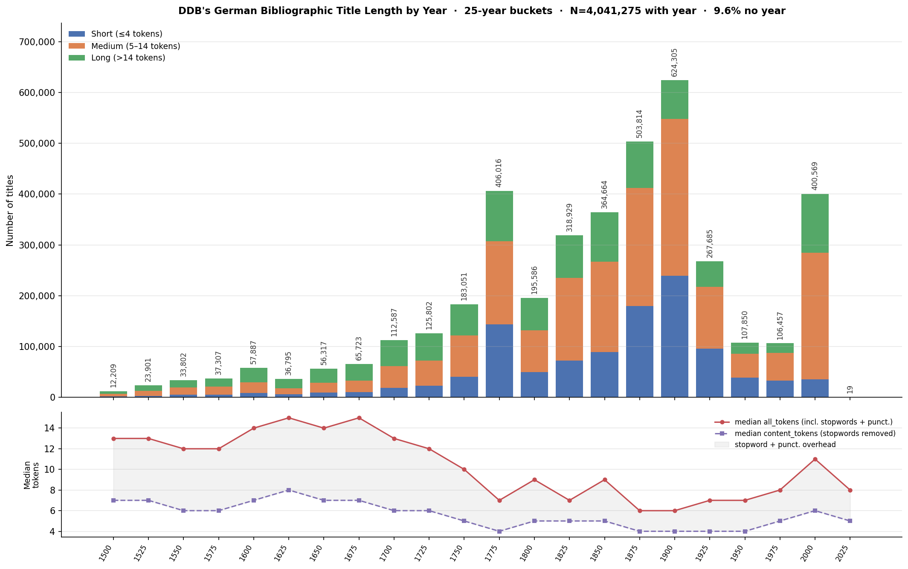

# GeMeA NER Pipeline — Presentation Spiel

## 0. ISBD Punctuation Structure

ISBD (International Standard Bibliographic Description) structures a catalog record into **areas** separated by `. -` (space · period · space · hyphen · space). Each area is internally punctuated with trailing marks that signal the next field. ([sr01_isbd-field-rating.md](sr01_isbd-field-rating.md), [sr01_isbd-applicability.md](sr01_isbd-applicability.md))

**Fully conformant record:**
```
Title proper : other title information / statement of responsibility
  . - Edition statement
  . - Place of publication : Publisher, Year
  . - (Series ; volume)
```

**Punctuation signals and their fields:**

| Signal | Field | Example |
|---|---|---|
| `. -` | Area separator | `Faust : ein Fragment. - Weimar : Hoffmann, 1790` |
| ` :` | Subtitle (OTHER_TITLE) | `Faust : ein Fragment` |
| ` /` | Statement of Responsibility (PERSON) | `Faust / von Goethe` |
| ` =` | Parallel title | `Faust = Faust` |
| ` ;` | Series volume separator | `(Schriften ; Bd. 7)` |

## 1. Scale of the fallback

~**71.6%** of DF_DE_TITLES (3.2M of 4.48M records) are expected to use the NER fallback.

- **Goethe-Faust pilot** (115K records): ~29% had any ISBD signal → ~71% NER fallback. ([../ner-bibliographic.md](../ner-bibliographic.md))
- **DF_DE_TITLES** (4.48M records — German-language `content`-type DDB objects, filtered by `dc:language` + `langid`[^langid]; 4.48M of 16.8M total DDB objects): 28.4% have ≥1 accepted ISBD signal → **71.6% NER fallback**. Trailing `.` excluded (93% FP — [sr05_trailing-period-noise.md](sr05_trailing-period-noise.md)). ([sr01_isbd-title-analysis.md](sr01_isbd-title-analysis.md), [sr10_de-titles-distribution.md](sr10_de-titles-distribution.md))
- Both estimates converge within 0.6 pp, confirming the pilot generalises to the full corpus.



- Longest title: 921 tokens — a [cataloging artifact](sr10_de-titles-distribution.md#5-longest-title-in-the-dataset): 33 concatenated bibliographic descriptions from a collective review in *Allgemeine Literatur-Zeitung* (1831). [DDB record](https://www.deutsche-digitale-bibliothek.de/item/52Q5EDQ44JLQS4WFJL2UNTHBQ4TZPAPB)


## 2. Label set

**Phase 1 (paper scope):** `TITLE`, `OTHER_TITLE`, `PERSON`

**Phase 2 (future):** `TRANSLATOR`, `PARALLEL_TITLE`, `MEDIUM`

**Deferred:** `PUBLISHER`, `PLACE`, `YEAR`, `EDITION`, `SERIES`, `VOLUME`

**How the selection was made** — DDB records are Manifestation-level (a specific published item). FRBR Work and Expression are derived by grouping, not directly encoded. The label set follows this hierarchy (SR-07 — [../ner-bibliographic.md §2.7](../ner-bibliographic.md)):

- Phase 1 covers **Work-level** identity: the title, subtitle, and responsible person are the minimum needed to look up a GND Work entry. This is the paper's core claim.
- Phase 2 adds **Expression-level** attributes once Work linking is validated.
- Manifestation labels are useful for deduplication but irrelevant to GND Work identity — deferred.

**Why `TRANSLATOR` and `EDITOR` were dropped from Phase 1** — SR-04 found 0 true translators in a 100-record sample of ` /` SoR strings; EDITOR detection had 0 F1. Neither label is reliably recoverable from the title string alone. ([sr04_translator-person-disambiguation.md](sr04_translator-person-disambiguation.md))

## 3. Why off-the-shelf NER models don't work

**Wrong labels.** Standard NER models (spaCy, Flair, BERT-NER) are trained on PER / ORG / LOC / MISC. None of them have `TITLE` or `OTHER_TITLE`. There is no fine-tuned model for bibliographic catalog string segmentation.

**Wrong domain.** DDB title strings are ISBD catalog records, not prose. The input to the NER model is not a sentence — it is a structured string where ` :` marks a subtitle boundary and `. -` marks an area separator. General-purpose models have never seen this register.

**Historical register.** Pre-1750 records are the hardest stratum (SR-10: 42–50% long strings, median 12–15 tokens). They exhibit:
- Author credentials and name *before* the title, with no ` /` marker — systematic false negative for any SoR-based approach
- Non-standard Early Modern German orthography (`ck`/`ch` clusters, umlaut spellings) that degrades subword tokenisation
- Long title-page transcriptions that read more like a table of contents than a title

SR-06 measured the historical stratum: **93% Early Modern German, ~0.5% Latin** — so dedicated Latin models (LatinBERT) are not warranted, but standard modern German models still fail on the dominant early modern register. ([sr06_historical-scope.md](sr06_historical-scope.md))

**Historical NER models are the wrong task.** Models trained for historical NER (e.g. HIPE-2022 systems) extract person and place names from newspaper text. That is a different task — named entity recognition in running prose — not catalog string segmentation. Their label sets and training distributions do not transfer.

**The path forward** — NuNER Zero is the first test: a zero-shot token classifier that can be prompted with label descriptions (`"title of the work"`, `"subtitle"`, `"author name"`). If its precision falls below threshold, the fallback is LLM annotation + fine-tuned `xlm-roberta-base`. ([../ner-bibliographic.md §5–6](../ner-bibliographic.md))

## 4. Why NuNER Zero

NuNER Zero (NuMind, EMNLP 2024) — zero-shot NER token classifier, ~180M params, CPU-capable. ([ref_gliner-nunerzero-comparison.md](ref_gliner-nunerzero-comparison.md))

| | Claim | Note |
|---|---|---|
| ✅ | Zero-shot: entity types are natural language strings at inference — no labeled DDB data needed | |
| ✅ | Token classifier → no span-length ceiling | GLiNER hard-caps at 12 tokens; truncates verbose pre-1750 strings |
| ✅ | Few-shot matches UniversalNER-7B at 1/56th the parameters | Bogdanov et al., EMNLP 2024, Table 2 |
| ✅ | Inference cost negligible vs. LLM API | <$0.0001/example |
| ❌ | Zero-shot capability **not evaluated in the paper** | Authors explicitly disclaim it (p. 11836); cited zero-shot benchmarks are not from this publication |
| ❌ | Training data English-only (C4 + GPT-3.5) | No German, no historical text, no bibliographic domain |
| ❌ | Heavy-tailed concept distribution — rare types likely underperform | `TRANSLATOR`, `SERIES` far less frequent in training than `PERSON`, `LOCATION` |
| ❌ | Not evaluated on historical German, ISBD strings, or DDB data | SR-09 (500 stratified records) required before any conclusion |

- **vs. GLiNER** — same zero-shot premise, span-based with 12-token cap. NuNER Zero preferred: no length ceiling, stronger numbers. The +3.1 pp headline is not comparable: GLiNER reports entity-level exact-match F1[^exact]; NuNER reports macro-averaged token-classification F1[^macro].
- **vs. fine-tuned xlm-roberta-base** — supervised XLM-R would likely gain ~22 pp F1 (MultiCONER zero-shot vs. supervised gap), but requires labeled data that doesn't exist yet. NuNER Zero is the bridge.

## 5. Evaluation metric

### 5.1 Which metric and why

- **Exact span match** — prediction correct only if both character boundaries and label match gold exactly; partial overlaps do not count
- Standard NERC protocol (HIPE-2022 strict regime, CoNLL benchmarks); gives a clean binary signal that maps directly to GND linking utility — the title string is either right or wrong
- Fuzzy match excluded: boundary overlap without exact match does not produce a usable title for linking
- Risk: pre-1700 long titles have genuinely ambiguous TITLE/credential boundaries → annotator disagreement penalises the model for inconsistency, not extraction failure; boundary curation decisions documented in [sr08_title-boundary-curation.md](sr08_title-boundary-curation.md)
- **Reported per label per era** — no macro or micro averages across labels
  - Micro F1 excluded: TITLE present in ~100% of records → pooled score is dominated by TITLE; OTHER_TITLE and PERSON disappear
  - Macro F1 excluded: PERSON appears in 0.2%–8.7% of records — averaging it equally with TITLE would let low PERSON performance misrepresent the pipeline's actual utility
- **Point estimates** (micro P/R/F1 per label per era), following HIPE-2022 convention; sample size reported alongside every figure
- Bootstrap CI deferred — ~100 records per era stratum yields ±10–15 pp CIs, too wide to be informative; see §5.3

### 5.2 Target scores

**How the strata were determined:**

- *Era* and *stratum* are used interchangeably throughout — each era is one evaluation stratum
- Strata are defined by **NER difficulty**, not by equal corpus size or calendar convention
- Primary signal: title-length distribution — longer titles mean harder TITLE boundary detection (see §7.2, `data/processed/sr10_era_length_summary.csv`)
- Secondary signal: register shift — author placement, orthography, and ISBD adoption all change discontinuously at the same boundaries

| Stratum | Boundary rationale |
|---|---|
| Pre-1700 | Author-before-title convention; early modern orthography; no ISBD; 46.9% long titles, median 13 tokens |
| 1700–1800 | Transition: ISBD adoption begins ~1750; author placement mixed; 32.0% long titles |
| 19th-c | ISBD stabilises; serials and newspapers dominate; median drops to 8 tokens |
| Modern (≥1900) | Digital-born metadata; subtitles in separate fields; short titles; ISBD rare in title string |

- F1 targets are grounded in benchmark ceilings, not assumed performance

| Stratum | TITLE F1 target | PERSON F1 target |
|---|---|---|
| Modern | ≥ 0.85 | — (person names in title: 0.2%) |
| 19th-c | ≥ 0.80 | — |
| 1700–1800 | ≥ 0.75 | ≥ 0.70 |
| Pre-1700 | ≥ 0.70 | ≥ 0.70 |

- **Why not 0.90?** — above the ceiling of comparable benchmarks:
  - OntoNotes WORK_OF_ART: DeepPavlov reports **0.532 F1** ([DeepPavlov NER docs](https://docs.deeppavlov.ai/en/0.0.8/components/ner.html)); Schweter & Akbik (2021) FLERT is the SOTA paper in references but does not report per-entity scores
  - HIPE-2022 German NERC-Coarse strict F1: hipe2020-de best system **0.794** (19C–20C Swiss/Luxembourgish newspapers); neural baseline 0.703
  - HIPE-2022 **sonar** (Berlin State Library, 19C–20C German newspapers, no train set): best system (AAUZH) **0.529**, neural baseline (XLM-R BASE) **0.307** — most comparable to GeMeA; low scores driven by absence of a train set, forcing cross-dataset transfer (Ehrmann et al., 2022, Table 7)
  - Pre-1700 historical orthography + author-before-title structure goes beyond anything in these benchmarks
- **Why PERSON only for pre-1700 and 1700–1800?** — person names appear in only 0.6% of 19th-c and 0.2% of modern titles; NER adds nothing there regardless of F1 ([sr08_evaluation-design.md §1](sr08_evaluation-design.md))

### 5.3 Ideal evaluation metric

- Bootstrap CI[^bootstrap] is the methodologically correct choice for F1: F1 has no closed-form variance (it is a ratio of precision and recall, each itself a ratio of counts), so resampling is the only principled way to quantify uncertainty
- Deferred here due to **low** sample size — ~100 records per era stratum yields ±10–15 pp CIs, too wide to be informative
- Becomes necessary when comparing two systems where the difference is small; not required here as the paper's claim is pipeline viability, not model comparison

## 6. Silver Dataset

**Why a silver dataset is necessary:**

- 4.5M records cannot be manually annotated; a fully supervised approach requires labeled data at scale
- NuNER Zero is zero-shot — it produces predictions, but without any labeled signal there is no way to measure where it fails or to fine-tune if it does
- The fallback plan (LLM annotation + fine-tuned XLM-R) requires training data; silver labels are the only scalable source

**How ISBD punctuation enables automatic labeling:**

- ISBD signals are structural markers embedded in the title string — each punctuation pattern maps directly to a label:

| Signal | Fires on | Silver label assigned |
|---|---|---|
| ` :` | Subtitle boundary | `OTHER_TITLE` — text after ` :` |
| ` /` (after sub-classification) | True person SoR | `PERSON` — text after ` /` |
| 4-digit year in expected position | Publication year | year span (Manifestation, deferred) |

- No human annotation needed — the rule fires on the string, the span is extracted, the label is assigned automatically across all 4.5M records
- The text *before* any firing signal is assigned `TITLE` by default — the rule-based pipeline implicitly labels the majority class at zero cost

### 6.1 ISBD signal coverage in DDB

Coverage from `data/processed/sr01_isbd_field_ratings.csv`; FP rates from `data/processed/sr03_heuristic_validation_sample.csv`. Full rule-by-rule decisions: [sr01_isbd-applicability.md §2](sr01_isbd-applicability.md).

| Signal | Coverage | Decision |
|---|---|---|
| `. -` area separator | [**1.2%**](sr01_isbd-field-rating.md) | ✅ Accept — high precision when present |
| ` :` subtitle | [20.2%](sr01_isbd-field-rating.md) | ✅ Accept — [~8% FP](sr03_silver-label-fp-review.md) |
| 4-digit year | [14.6%](sr01_isbd-field-rating.md) | ✅ Accept — [~6% FP](sr03_silver-label-fp-review.md) |
| ` /` SoR | [0.8%](sr01_isbd-field-rating.md) | ⚠️ Sub-classify — [36% FP for PERSON; 41% non-SoR](sr04_translator-person-disambiguation.md) |
| ` =` parallel title | [0.6%](sr01_isbd-field-rating.md) | ❌ Exclude — [~80% FP](sr03_silver-label-fp-review.md); DDB serials repurpose `=` for enumeration (e.g. [`7. Januar-30. December 1891 = 1.-21. Stück`](https://ddb.de/item/UAEOTQYLDUDCNSSG2IXPY4JM6G4MDD27)) |
| Edition keyword | [3.6%](sr01_isbd-field-rating.md) | ❌ Exclude — [~83% FP](sr03_silver-label-fp-review.md); newspapers use "Ausgabe vom [date]" as issue label (e.g. [`Erste Ausgabe vom Dienstag, den 18. Mai 1937.`](https://ddb.de/item/YASRD5RWR6SXOLRMJ24A66FL4EWJ5ZNP)) |
| Trailing `.` | [17.5%](sr01_isbd-title-analysis.md) | ❌ Exclude — [~93% FP](sr05_trailing-period-noise.md) ([abbreviations](sr05_abbreviations.md), ordinals) |

- Most DDB records are catalogued with **title-area punctuation only** — `. -` area separators are nearly absent
- ` /` (SoR) fires on four distinct content types: individual person ([35%](sr04_translator-person-disambiguation.md)), corporate body ([19%](sr04_translator-person-disambiguation.md)), editor ([5%](sr04_translator-person-disambiguation.md)), non-SoR false positive ([41%](sr04_translator-person-disambiguation.md)) — sub-classification required before use as a PERSON label
- Pre-1750 records have **no ` /` marker** even when an author is named — author credentials appear before the title, not after it

### 6.2 Silver tiers

Three tiers reflect three qualitatively distinct inference paths — not a spectrum, but categorical evidence levels. ([sr01_isbd-field-rating.md](sr01_isbd-field-rating.md), [sr01_isbd-applicability.md](sr01_isbd-applicability.md))

| Tier | Label | Criterion | Inference path |
|---|---|---|---|
| **2** | Structural | `has_dot_dash` AND `f_person` AND ≥1 of {place, publisher, year, series} | Deterministic ISBD parsing — multi-field spans extractable with high confidence |
| **1** | Heuristic | `n_fields ≥ 3` OR (`f_person` AND `f_year`) | Converging weak signals — no area separator, but enough co-occurring fields to reduce coincidence risk |
| **0** | Fallback | All else | No ISBD signal — pure NER inference; model must rely on learned patterns alone |

- **Tier 2 gating criterion**: `. -` area separator (`has_dot_dash`) — indicates fully structured ISBD record; its presence is categorical, not a degree
- **Tier 1 threshold**: `n_fields ≥ 3` requires at least three independent signals to fire together; OR `f_person AND f_year` because authorship + date co-occurrence is a strong heuristic for a structured SoR
- **Tier 0** is the primary NER target — 92.4% of DF_DE_TITLES; model performance matters most here. Note: tier-0 ≠ "no signals at all" — 71.6% have zero accepted ISBD signals (§1 NER fallback); the remaining ~20.8 pp have partial signals (e.g. only ` :` fires) but insufficient convergence to reach the tier-1 threshold (`n_fields < 3` and no `f_person AND f_year`)
- Fields excluded from tier logic: `f_parallel` (~80% FP), `f_edition` (~83% FP) — validated by SR-03 ([sr03_silver-label-fp-review.md](sr03_silver-label-fp-review.md))
- `f_person` requires sub-classification before use: 36% FP as PERSON; 41% are non-SoR false positives ([sr04_translator-person-disambiguation.md](sr04_translator-person-disambiguation.md))

### 6.3 Tier composition

Source: `data/processed/sr01_isbd_field_ratings.csv` (4,477,780 records; run 2026-03-21) and `data/processed/sr08_corpus_cell_sizes.csv`.

**Corpus-wide:**

| Tier | Records | % |
|---|---|---|
| Tier 2 — structural | 4,613 | 0.1% |
| Tier 1 — heuristic | 335,524 | 7.5% |
| Tier 0 — fallback | 4,137,643 | 92.4% |

**By era:**

| Era | Tier 0 | Tier 1 | Tier 2 | Total |
|---|---|---|---|---|
| Pre-1700 | 259,434 | 19,102 | 0 | 278,536 |
| 1700–1800 | 530,576 | 36,088 | 1,274 | 567,938 |
| 19th-c | 830,570 | 91,610 | 3,265 | 925,445 |
| Modern | 1,123,728 | 75,185 | 70 | 1,198,983 |

- **Pre-1700: zero tier-2 records** — pre-ISBD titles predate area-separator conventions; `has_dot_dash` never fires
- **Modern: only 70 tier-2 records** — digital-born metadata stores subtitle in a separate field, so `. -` does not appear in the title string even when the full ISBD record exists

## 7. Gold Dataset

- **Ground truth** — human-annotated spans are the only basis for computing F1; without a gold set there is no way to measure model performance
- **Stratified evaluation** — overall accuracy is uninformative; the gold set enables per-label (TITLE, OTHER_TITLE, PERSON) × per-era F1, revealing exactly where the model succeeds and where it fails
- **Pipeline claim** — the paper's contribution is that the pipeline produces usable extractions across eras; gold evaluation is the evidence for that claim
- **Failure mode coverage** — the gold set must include all inference paths (tier-0, tier-1, tier-2) and the highest-risk genres (Leichenpredigt, Einblattdruck) or the evaluation cannot generalise to the full corpus

### 7.2 Era and title distribution

The four era strata are defined by NER difficulty, not by equal corpus size. Title length is the primary difficulty signal — longer titles mean harder TITLE boundary detection. 

Source: `data/processed/sr10_era_length_summary.csv` (script: `sr10_era_length_summary.py`). Record counts include title-regex year fallback; totals differ from `sr08_corpus_cell_sizes.csv`, which uses the `dates` column only.

| Era | Corpus records | Short ≤4 | Medium 5–14 | Long >14 | Median tokens | Key NER challenge |
|---|---|---|---|---|---|---|
| Pre-1700 | 331,349 | 15.7% | 37.4% | **46.9%** | 13 | [Author-before-title](https://www.deutsche-digitale-bibliothek.de/item/KQCJ7APICPYVGBUZ544FKAICNU73FVKH); early modern orthography; [long title-page transcriptions](https://www.deutsche-digitale-bibliothek.de/item/PBKMFCEQ2CM622H4SXHBIA5KYYJUQO6U) |
| 1700–1800 | 827,456 | 27.4% | 40.6% | **32.0%** | 9 | Transition period; [author placement mixed](https://www.deutsche-digitale-bibliothek.de/item/TESMJCHDS7J3G74XAGVKMC7JBBD6F4PV); title lengths still elevated |
| 19th-c | 1,382,993 | 28.3% | 47.4% | 24.3% | 8 | Serials and newspapers dominate; corporate SoRs; `Ausgabe` [noise](https://www.deutsche-digitale-bibliothek.de/item/YASRD5RWR6SXOLRMJ24A66FL4EWJ5ZNP) |
| Modern (≥1900) | 1,935,982 | 30.9% | 51.4% | 17.6% | 8 | Short bare titles; subtitle often in separate field; ISBD rare |

- **Pre-1700** is the hardest stratum: 46.9% long titles, median 13 tokens. Title-page conventions fold subtitle, author, place, and printer into one string — TITLE boundary is structurally ambiguous. Author credentials appear *before* the title with no ` /` marker; no ISBD punctuation.
- **1700–1800** is a transition: long-form conventions persist into the early 18th century (32.0% long overall), then decline from 1750 onward. Author placement mixed — some pre-1750 author-before-title, some ISBD-conformant. ⚠️ *The attributed cause (shift in publishing conventions) is supported by Wittmann (1999) and Jäger (2001) but neither source contains quantitative title-length data — the quantitative evidence is from DF_DE_TITLES itself; citation pending verification.*
- **19th-c** median stabilises at 8 tokens; 28.3% short. NER challenge shifts from boundary ambiguity to domain noise: newspaper records misuse `=` and edition keywords; corporate SoRs dominate ` /` signals.
- **Modern** median 8 tokens, 30.9% short, 51.4% medium — digital-born metadata with richer descriptions, but subtitles stored separately, so ` :` recall drops even when a subtitle exists.

### 7.3 Stratification Dimensions

| Dimension | Strata | Why |
|---|---|---|
| Era | pre-1700 / 1700–1800 / 19th-c / modern | Difficulty and register vary sharply across eras |
| Silver tier | tier-0 / tier-1 / tier-2 | Must cover all inference paths; tier-0 is 92.4% of corpus |

**Oversampling (not a stratification axis):**

| Genre | Target n | Rationale |
|---|---|---|
| Leichenpredigt | ~40–50 | Highest pre-1750 density; most structurally distinctive title-page conventions |
| Einblattdruck | ~40–50 | Highest-risk failure mode for NER boundary detection |

- Drawn from pre-1700 / 1700–1800 strata — oversampling within era, not a separate dimension ([sr08_gold-set-composition.md](sr08_gold-set-composition.md))

### 7.4 Confidence Interval

- F1 is computed on a finite gold set — the observed F1 is a point estimate with sampling uncertainty
- A **confidence interval** (CI) quantifies that uncertainty: "the true F1 lies within ±X pp of the observed value with 95% probability"[^ci95]
- Narrower CI → stronger claim; wider CI → result is only indicative
- CI width is determined by **sample size** and **prevalence** of the entity being measured: rare labels need far more records to achieve the same CI width as common ones

**Wilson CI — why not Wald?**

| | Wald CI | Wilson CI |
|---|---|---|
| Behaviour near 0 or 1 | Breaks — can produce negative lower bound or upper bound > 1 | Well-behaved at all prevalences |
| Small n | Unreliable | Reliable |
| Used here | ❌ | ✅ |

- Wald CI assumes the normal approximation holds — it fails when p̂ is close to 0 or 1, or when n is small; both conditions hold for PERSON in early strata
- Wilson CI inverts the score test directly; remains valid for low prevalence and small samples ([Brown et al., 2001](https://doi.org/10.1214/ss/1009213286))

### 7.5 Sample Size Targets

**395 records** — drawn from DF_DE_TITLES, stratified by era × silver tier × dc_type. ([sr08_gold-set-composition.md](sr08_gold-set-composition.md), [sr08_evaluation-design.md](sr08_evaluation-design.md))

- TITLE prevalence ~100% per record → record count ≈ entity instance count → Wilson CI on TITLE F1 ≈ Wilson CI on proportion

**Minimum instance count formula** (Wilson interval approximation, treating F1 as a proportion):

$$n = \frac{z^2 \cdot p(1-p)}{e^2}$$

| Term | Value used | Meaning |
|---|---|---|
| $n$ | — | Minimum entity instances needed |
| $z$ | 1.96 | Z-score for 95% CI |
| $p$ | target F1 per stratum | Assumed true F1 (worst-case variance at p = 0.5) |
| $e$ | 0.05 or 0.10 | Desired half-width (±5 pp or ±10 pp) |

- Records needed = $n$ / entity prevalence per stratum (TITLE ≈ 100%; PERSON from `sr08_check_person_in_title.py`)
- This is a lower bound — bootstrap CI for F1 is empirically wider; actual required $n$ may be larger

Minimum records per era by CI target (`data/processed/sr08_ci_sample_size.csv`, script: `sr08_ci_sample_size.py`):

| Stratum | Metric | Target F1 | ±5 pp records | ±10 pp records | Current gold |
|---|---|---|---|---|---|
| Pre-1700 | TITLE | ≥ 0.70 | 323 | 81 | 130 ✅ |
| Pre-1700 | PERSON | ≥ 0.70 | 3,713 | 932 | 130 ❌ |
| 1700–1800 | TITLE | ≥ 0.75 | 289 | 73 | 80 ✅ |
| 1700–1800 | PERSON | ≥ 0.70 | 6,460 | 1,620 | 80 ❌ |
| 19th-c | TITLE | ≥ 0.80 | 246 | 62 | 60 ✅ |
| Modern | TITLE | ≥ 0.85 | 196 | 49 | 80 ✅ |
| **Total (TITLE only)** | | | **1,054** | **265** | **350** ✅ |

- **±10 pp chosen** — ±5 pp requires 1,054 records (not feasible); current 395-record set exceeds the 265-record ±10 pp minimum
- **PERSON CI is not achievable at practical cost** — ±10 pp on PERSON alone requires 932 pre-1700 and 1,620 1700–1800 records; see §7.6


### 7.6 PERSON Constraint

- Person names in title: 8.7% pre-1700, 5.0% 1700–1800 — far too sparse to hit ±10 pp CI without thousands of records
- ±10 pp on PERSON needs 932 pre-1700 records, 1,620 for 1700–1800 — not feasible
- Decision: accept wide CI on PERSON; report as indicative only; must be stated explicitly in the paper

### 7.7 Annotation scope

- Leichenpredigt and Einblattdruck oversampled (~40–50 each) — highest-risk failure modes
- Phase 2 labels (`TRANSLATOR`, `PARALLEL_TITLE`, `MEDIUM`) annotated in the same pass to avoid re-annotation — excluded from Phase 1 evaluation claims


[^ci95]: The 95% figure is a conventional choice (α = 0.05). It means: if the same sampling procedure were repeated many times, 95% of the resulting intervals would contain the true value. It does not mean the true value has a 95% chance of falling in this particular interval.
[^langid]: `dc:language = 'ger'` (Dublin Core metadata-declared language, ISO 639-2) AND `langid = 'ger'` (automatic language identification applied as a second filter to correct mis-declared records). <https://pypi.org/project/langid/>
[^bootstrap]: Efron, B., & Tibshirani, R. (1993). *An Introduction to the Bootstrap.* Chapman & Hall.
[^exact]: **Entity-level exact-match F1** — a predicted span counts as correct only if both its boundaries and label exactly match the gold annotation.
[^macro]: **Macro-averaged F1** — F1 computed per class, then averaged across classes (each class weighted equally regardless of frequency). Contrast with micro-average, where all instances are pooled and frequent classes dominate.
