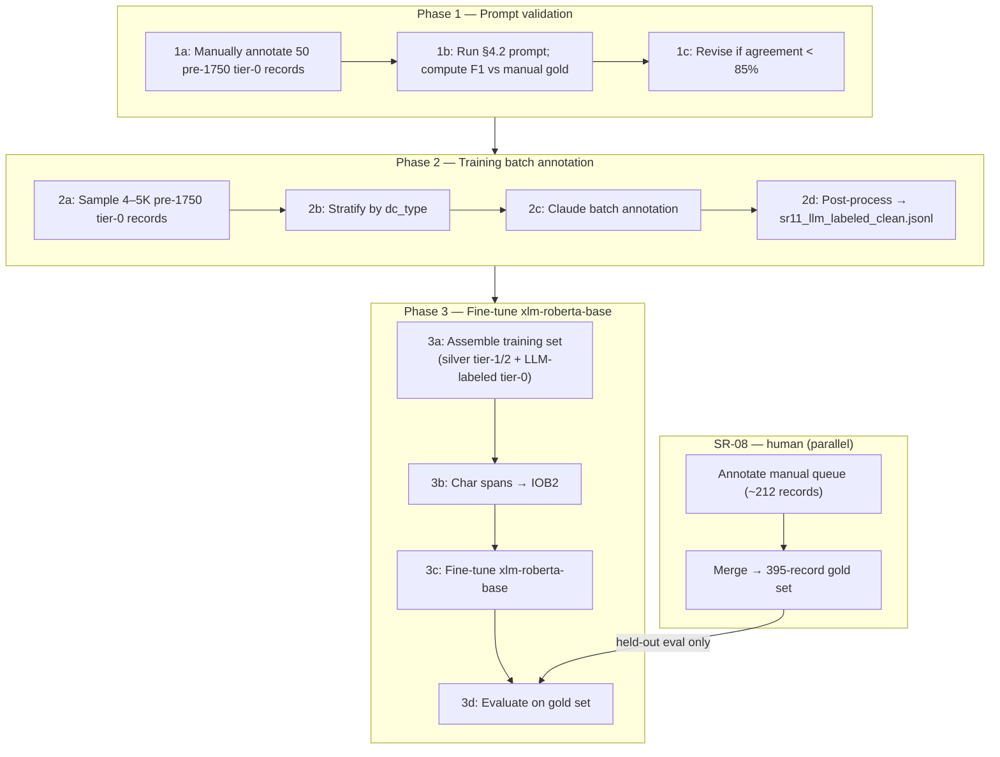

# NER Labeling Strategy — Dataset Size and LLM Annotation

**Status:** 🔄 Active — unblocked 2026-03-28 (SR-08 complete, SR-09 resolved)

Related: [ner-bibliographic.md §8](../ner-bibliographic.md), [SR-08](../ner-bibliographic.md#28-sr-08--gold-set-composition), [SR-09](../ner-bibliographic.md#29-sr-09--nuner-evaluation)

---

## 0. Context

SR-09 (2026-03-27) confirmed NuNER zero-shot is not viable (F1 = 0.000 on all labels). Root cause: token-level classifier with no concept of bibliographic field segmentation. The LLM one-time labeler → fine-tune `xlm-roberta-base` path is confirmed.

SR-08 is complete: 395-record gold sample drawn, tier-2 records pre-filled (47), manual queue exported (`sr08_manual_queue.csv`). SR-11 is now unblocked.

**Open question — silver-only baseline:** The minimum viable path is silver-only fine-tuning (~340K tier-1/2 records, no LLM annotation). SR-11 exists because pre-1700 has zero silver records and silver-only will almost certainly fail there. Options:

- **Run silver-only first:** provides a baseline for the paper; modern/19th-c will pass, pre-1700 is where it breaks.
- **Skip to LLM annotation:** pre-1700 failure is predictable; the paper needs LLM annotation for a novel contribution regardless (mirrors NuNER's method).

**Decision (2026-03-30):** open — flag in paper as experiment design choice.

---

## 0.1 Execution plan

Three phases in order. Phase 1 validates the prompt; phases 2–3 build the training set. SR-08 human annotation runs in parallel.



**Phase 1 — Validate LLM annotation prompt**

Validation uses 50 manually annotated pre-1750 tier-0 records — same domain, era, and dc_type distribution as Phase 2. This directly tests the §4.2 prompt on actual target data. Tier-2 ISBD pre-filled records are modern and do not exercise pre-1750 annotation rules.

| Step | What | Records | Output |
|---|---|---|---|
| 1a | Manually annotate 50 pre-1750 tier-0 records stratified by dc_type | 50 | `sr11_prompt_validation_manual.jsonl` |
| 1b | Run §4.2 prompt on same 50 records; compute exact-match F1 per label | 50 | Agreement rate vs. manual gold |
| 1c | Revise prompt if agreement < 85% on any label; re-run | — | Updated system prompt |

**Phase 2 — Annotate training batch (pre-1750 tier-0)**

| Step | What | Records | Output |
|---|---|---|---|
| 2a | Sample 4–5K pre-1750 tier-0 records | 4–5K | `sr11_training_sample.csv` |
| 2b | Stratify by dc_type: Leichenpredigt, Monografie, Einblattdruck | — | Stratum-balanced sample |
| 2c | Run Claude batch annotation (batches of 20–50, temperature 0) | 4–5K | `sr11_llm_labeled.jsonl` |
| 2d | Post-process: detect and discard hallucinated/malformed spans | — | `sr11_llm_labeled_clean.jsonl` |

**Phase 3 — Fine-tune xlm-roberta-base**

| Step | What | Notes |
|---|---|---|
| 3a | Assemble training set | Silver tier-1/2 (~340K) + LLM-labeled tier-0 (~4–5K) |
| 3b | Convert to IOB2 token labels | Character spans → token-aligned IOB2 |
| 3c | Fine-tune `xlm-roberta-base` | Token classification head; multilingual pretraining |
| 3d | Evaluate on gold set | Point-estimate F1 per label per era (held out, human-verified) |

**Gold set is held out for evaluation only — not included in training, not used as few-shot examples.**

---

## 0.2 Task register

**Phase 1 — prompt validation**
- [ ] **T11.1a** Sample 50 pre-1750 tier-0 records; stratify by dc_type; exclude SR-08 gold `obj_id`s (`sr11_sample_validation.py`)
- [ ] **T11.1b** Annotate the 50 records manually (`sr11_annotate.py`) → `sr11_prompt_validation_manual.jsonl`
- [ ] **T11.1c** Run `sr11_eval_prompt.py`; compute span-level exact-match F1 per label
- [ ] **T11.1d** PERSON recall ≥ 80%? (author-before-title is the main failure mode)
- [ ] **T11.1e** TITLE boundary correct on "Das ist:" records?
- [ ] **T11.1f** Embedded Latin tokens (`Anno`, `Christi`) not labelled as separate entities?
- [ ] **T11.2a** If agreement < 85% on any label: revise system prompt, add targeted few-shot example, re-run
- [ ] **T11.2b** Once ≥ 85% on all three label types: proceed with Phase 2
- [ ] **T11.3** Prompt hash (SHA-256) and model ID logged for reproducibility

**Phase 2 — training batch annotation**
- [ ] **T11.4** Sample 4–5K pre-1750 tier-0 records (`sr11_training_sample.csv`)
- [ ] **T11.5** Stratum balance confirmed: Leichenpredigt, Monografie, Einblattdruck represented
- [ ] **T11.6** Claude batch annotation run (batches of 20–50, temperature 0)
- [ ] **T11.7** Post-processing: hallucinated spans discarded, malformed brackets flagged
- [ ] **T11.8** Manual spot-check of ~200 records (~5%) — agreement rate recorded
- [ ] **T11.9** `sr11_llm_labeled_clean.jsonl` written

**Phase 3 — fine-tuning**
- [ ] **T11.10** Training set assembled: silver tier-1/2 + LLM-labeled tier-0
- [ ] **T11.11** Character spans converted to IOB2 token labels
- [ ] **T11.12** `xlm-roberta-base` fine-tuned (token classification head)
- [ ] **T11.13** Evaluated on gold set — point-estimate F1 per label per era recorded

**Parallel (SR-08 — human)**
- [ ] **T11.14** Gold manual queue (~212 records) annotated
- [ ] **T11.15** Merged with pre-filled (47) + partial tier-1 records → 395-record gold set complete

---

## 0.3 Open decisions

- **Gold set in training?** Current plan: hold out entirely. Alternative: leave-one-era-out CV. Decision deferred to Phase 3.
- **Era mix for training sample:** uniform across pre-1700 / 1700–1800, or weighted by corpus distribution? Leichenpredigt and Einblattdruck oversampled as in SR-08.
- **xlm-roberta-base vs. large?** Base chosen for feasibility (§10 decision). Large benchmarked as stretch goal if base results are marginal.
- **Small fine-tuned LLM (Qwen3-1.7B + LoRA)?** Listed in §10 as a third benchmark option; deferred until base XLM-R results are available.

---

## 1. Fine-tuning dataset size by FRBR scope

Working assumption: **200–500 annotated spans per entity type** is the practical minimum for reliable boundary learning from a strong multilingual checkpoint (xlm-roberta-large). Below ~200 per type, type confusion and boundary errors dominate; above ~500, returns diminish rapidly for a focused label set. This assumption will be validated against T11.13 evaluation results.

Translating to record counts (each bibliographic title typically yields 1–3 labeled spans):

| Scope | Label types | Spans needed | Est. records needed | Notes |
|---|---|---|---|---|
| Work only | `TITLE`, `OTHER_TITLE`, `PERSON` | ~900–1,500 spans | **1k–2k records** | Most titles have all three; efficient labeling |
| Work + Expression | + `TRANSLATOR`, `PARALLEL_TITLE`, `MEDIUM` | ~1,800–3,000 spans | **3k–5k records** | Expression types are sparse per record — need more records to reach span count |
| Full (incl. Manifestation) | + `PUBLISHER`, `PLACE`, `YEAR`, `EDITION`, `SERIES`, `VOLUME` | ~3,000–6,000 spans | **5k–10k records** | Manifestation fields extractable from ISBD silver; less urgent to label manually |

**Practical implication:** Work-only scope is achievable with 1k–2k LLM-labeled records for the pre-1750 stratum. The 4–5K Phase 2 target covers Work + Expression scope. Manifestation labels can be deferred — the ISBD silver set already covers these for the modern stratum.

The pre-1750 stratum is the binding constraint: it is entirely tier-0, so no silver labels exist regardless of scope. Modern records have 335k silver tier-1 and 4,613 tier-2 records — fine-tuning on the modern stratum is not the bottleneck.

---

## 2. LLM as annotator — using Claude

Using Claude to generate the pre-1750 labeled dataset is the most practical path. This is architecturally identical to the approach used to build NuNER's training corpus (GPT-3.5 annotating 1M sentences from C4 — the Colossal Clean Crawled Corpus, a filtered Common Crawl web corpus; Bogdanov et al., EMNLP 2024) and is consistent with the §8.2 recommendation in ner-bibliographic.md.

### 2.1 Why it works

- Early Modern German and bibliographic structure handling: confirmed empirically via few-shot examples (§4.3); see T11.1 validation results — no pre-existing citation
- Label definitions (TITLE, OTHER_TITLE, PERSON) are semantically clear — low ambiguity for an LLM
- Inline Bracketed is among the top-performing output formats for generative NER (Zhan et al. 2026: avg F1 90.69 vs 90.07 for Inline XML, both significantly above JSON formats; tested on LLaMA/Qwen — Claude extrapolated)
- Cost is negligible: 4k records × ~300 tokens average ≈ 1.2M tokens, a small fraction of API budget

### 2.2 Risks and mitigations

| Risk | Severity | Mitigation |
|---|---|---|
| Systematic errors on author-before-title (pre-1750) | High | Explicit annotation guideline in system prompt: "In pre-1750 titles, the author's name and credentials appear before the main title, not after ` /`. Label the opening name+credentials span as PERSON." |
| Type confusion: PERSON vs. TRANSLATOR | Medium | Include disambiguation rule: "Label as TRANSLATOR only if a translation keyword is present (`übersetzt`, `Übers.`, `transl.`, `traduit`)." |
| Hallucinated spans (text not in input) | Low–Medium | Use Inline Bracketed format — spans are extracted inline from the input string, reducing hallucination compared to generative span prediction |
| Systematic bias across similar records | Medium | Evaluate on the SR-08 gold set (human-annotated, independent); if LLM errors cluster on a dc_type or era, resample |
| Early Modern abbreviations / title-page conventions | Medium | Include 3–5 annotated examples in the prompt (few-shot) covering the main patterns |

---

## 3. Modern stratum — no labeling needed

Silver tier-1 (335,524 records) and tier-2 (4,613 records) cover the modern stratum with ISBD-derived labels. These are sufficient for fine-tuning the modern register without any additional annotation. The LLM labeling effort above is exclusively for the pre-1750 gap.

---

## 4. Early Modern German prompt design

### 4.1 Why Early Modern German requires a dedicated prompt

Standard NER prompts fail on pre-1750 German bibliographic titles for three structural reasons:

1. **Author-before-title structure** — the author's name, academic credentials, and role appear at the start of the title string, not after a ` /` separator. A prompt that expects modern bibliographic conventions will either miss the author or conflate the credential sequence with the title.
2. **Credential sequences as part of PERSON spans** — the PERSON span typically includes the author's degree chain: `D. Johann Georg Dorsche, der H. Schrifft ordentlichen Lehrers`. Degree abbreviation, full name, and role description are all part of the PERSON span.
3. **Embedded Latin vocabulary** — words like `Anno`, `Christi`, `Jesu`, `Doctor`, `Oratio`, `Disputatio` appear in otherwise German titles and do not indicate a Latin-language record. A prompt must not treat these as signals for a Latin entity type (see SR-06: true Latin prevalence ~0.5%).

### 4.2 System prompt

~~~
You are a bibliographic NER annotator specialising in Early Modern German (1500–1750) library catalog records.

## Task
Label named entity spans in the given title string using Inline Bracketed format:
  [span text | LABEL]

## Labels
- TITLE — the main work title; the primary intellectual content identifier
- OTHER_TITLE — subtitle or alternative title, typically introduced by "Das ist:", "oder", a colon, or "nämlich"
- PERSON — the author, editor, or other responsible person; includes their full name AND any preceding or following credentials, academic titles, or role descriptions that form a single naming unit

## Critical rule: author-before-title structure
In pre-1750 German titles, the author's name and credentials appear BEFORE the main title, not after a slash ( / ). The typical structure is:

  [credentials + name + role | PERSON] [main title | TITLE] [subtitle | OTHER_TITLE]

Example:
  Input:  "D. Johann Gerhard, Professoris zu Jena, Erklärung der Historien des Leidens vnd Sterbens vnsers HErrn Christi"
  Output: "[D. Johann Gerhard, Professoris zu Jena | PERSON] [Erklärung der Historien des Leidens vnd Sterbens vnsers HErrn Christi | TITLE]"

## PERSON span boundaries
Include in the PERSON span:
- Academic degree abbreviations immediately before the name: D. (Doktor), M. (Magister), Lic. (Licentiatus), Mag.
- Full personal name (first name + surname)
- Role or position descriptions following the name: "Pfarrers zu X", "der H. Schrifft Lehrers", "Professoris", "Pastoris", "Superintendenten"
- Genitive or prepositional phrases identifying the post: "zu Jena", "in Leipzig", "bey der Gemeine zu X"

Stop the PERSON span at the first token that is clearly part of the work title (a content noun, verb phrase, or "Das ist:").

## Embedded Latin — do NOT create a separate LATIN label
Words such as Anno, Christi, Jesu, Doctor, Oratio, Disputatio embedded in an otherwise German title are standard Early Modern Protestant/academic vocabulary. They do not make the record Latin. Label the surrounding title normally as TITLE.

## OTHER_TITLE triggers
Label as OTHER_TITLE the span introduced by:
- "Das ist:" / "Das ist,"
- "oder" (when introducing an alternative title, not a connector within the title)
- A colon after a complete TITLE span
- "nämlich", "welches handelt von", "begreiffend"

## Orthographic note
Do not treat early modern spelling variants as annotation errors. The following are standard:
- vnd / vnndt (and), seyn / sein (to be), deß / des (genitive), jhm / ihm
- u/v interchange: vber = über, vnser = unser, viel = viel
- ck clusters: drucken, Glück, Stück
- Double vowels: heer, Lehr, seelig
- Final -enn/-en variation: Herrenn, Christenn

## What NOT to label
- Dedicatees ("Dem … gewidmet", "Herrn N.N. zu Ehren") — do not label as PERSON unless they are also the author
- Occasion phrases ("Bey dem Leichbegängnis", "Gehalten am …") — do not label
- Place of publication, printer, year — do not label (out of scope)
- Generic role nouns without a personal name ("dem geneigten Leser", "der Christlichen Gemeine")
~~~

### 4.3 Few-shot examples

Include 5 examples covering the main structural patterns. Examples must come from outside the SR-08 gold set (held out for evaluation) — draw from `sr01_isbd_field_ratings.csv` excluding the 395 gold `obj_id`s. The following are manually curated:

**Pattern A — credential + name + role + title (most common pre-1750 pattern):**
```
Input:  "M. Andreas Musculus, Pfarrherr zu Frankfurt an der Oder, Vom Ehebruch vnd Hurerey"
Output: "[M. Andreas Musculus, Pfarrherr zu Frankfurt an der Oder | PERSON] [Vom Ehebruch vnd Hurerey | TITLE]"
```

**Pattern B — title first, author after "durch" / "von":**
```
Input:  "Christliche Leichpredigt, Vber den Tödtlichen Hintrit … durch Johann Schmidt, Pfarrern zu Straßburg"
Output: "[Christliche Leichpredigt | TITLE] [Vber den Tödtlichen Hintrit … | OTHER_TITLE] [Johann Schmidt, Pfarrern zu Straßburg | PERSON]"
```

**Pattern C — "Das ist:" subtitle:**
```
Input:  "Geistlicher Seelen-Schatz. Das ist: Außführliche Erklärung der fürnembsten Geheimnissen"
Output: "[Geistlicher Seelen-Schatz | TITLE] [Außführliche Erklärung der fürnembsten Geheimnissen | OTHER_TITLE]"
```

**Pattern D — embedded Latin, no extractable PERSON:**
```
Input:  "Oratio de vita et obitu Doctoris Martini Lutheri Anno MDXLVI"
Output: "[Oratio de vita et obitu Doctoris Martini Lutheri Anno MDXLVI | TITLE]"
```
*(Full string is Latin — label as a single TITLE. Do not extract "Martini Lutheri" as PERSON without a clear authorship signal outside the title string.)*

**Pattern E — author + named dedicatee:**
```
Input:  "D. Caspar Calvör, Pastoris zu Clausthal, Geistliche Haußhaltung … Herrn Anton Ulrich, Hertzogen zu Braunschweig, gewidmet"
Output: "[D. Caspar Calvör, Pastoris zu Clausthal | PERSON] [Geistliche Haußhaltung | TITLE] [Herrn Anton Ulrich, Hertzogen zu Braunschweig | PERSON]"
```
*(Label named dedicatees as PERSON — not generic dedications like "der Christlichen Gemeine gewidmet".)*

### 4.4 User prompt template

~~~
Annotate the following Early Modern German bibliographic title. Return only the annotated string, nothing else.

Title: {title_string}
~~~

For batch processing, send a numbered list in a single call:

~~~
Annotate each of the following Early Modern German bibliographic titles. Return a numbered list with only the annotated strings, one per line.

1. {title_1}
2. {title_2}
...
~~~

### 4.5 Batch processing notes

- **Batch size:** 20–50 records per API call
- **Temperature:** 0 — deterministic output required for reproducibility
- **Model:** `claude-opus-4-6` preferred for accuracy on Early Modern German; `claude-sonnet-4-6` for throughput at scale
- **Log:** model ID, SHA-256 of system prompt, timestamp, and batch index per call
- **Failure modes to detect in post-processing:**

| Failure | Detection | Action |
|---|---|---|
| Hallucinated text (output longer than input) | `len(output_spans_text) > len(input)` | Discard |
| No brackets in output | `[` not in output | Retry once, then discard |
| Unclosed bracket | Unmatched `[` or `\|` | Flag for manual review |
| Unknown label | Label not in `{TITLE, OTHER_TITLE, PERSON}` | Flag for review |
| Span text not found in input | Substring match fails | Discard (hallucinated span) |
