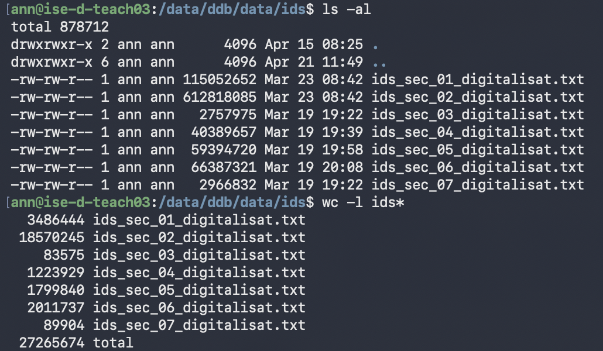

## 1. DDB ID corpus — 27 M digitalisat objects

**Host**: `ann@ise-d-teach03` (`10.10.4.10`), path `/data/ddb/data/ids/`

**Counts** (as of 2026-04-21):

| File | Sector | IDs | Size (MB) |
|---|---|---|---|
| `ids_sec_01_digitalisat.txt` | Archive | 3,486,444 | 109.7 |
| `ids_sec_02_digitalisat.txt` | Library | 18,570,245 | 584.5 |
| `ids_sec_03_digitalisat.txt` | Monument Preservation | 83,575 | 2.6 |
| `ids_sec_04_digitalisat.txt` | Research | 1,223,929 | 38.5 |
| `ids_sec_05_digitalisat.txt` | Media Library | 1,799,840 | 56.7 |
| `ids_sec_06_digitalisat.txt` | Museum | 2,011,737 | 63.3 |
| `ids_sec_07_digitalisat.txt` | Others | 89,904 | 2.8 |
| **Total** | | **27,265,674** | **858.1** |

### 1.1 Provenance

IDs were fetched from the live DDB Solr API using cursor-based pagination (cursorMark) to bypass the 10,000-row `maxResultWindow` limit. One ID per line. Filter: `sector_fct:<sector>` + `digitalisat:true`.

**Source script**: [`scripts/utils/fetch-ids-by-sector.py`](https://github.com/anntanp/gemea/blob/main/scripts/utils/fetch-ids-by-sector.py)

**API endpoint**: `https://api.deutsche-digitale-bibliothek.de/search/index/search/select`

**Run date**: files dated 2026-03-19 (sec_03–07) and 2026-03-23 (sec_01–02).

**Resume support**: each run writes a `.cursor` state file; deleted on clean completion.
